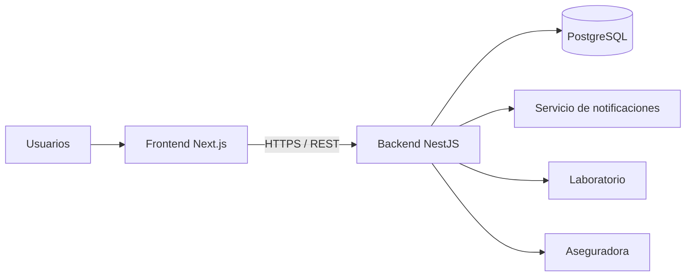

# Sistema Hospitalario — Arquitectura Monorepo

Este repositorio contiene únicamente la **arquitectura y estructura de archivos** de un sistema hospitalario.
No incluye implementación funcional ni lógica de negocio programada.

## Tecnologías seleccionadas

- **Backend:** NestJS + TypeScript
- **Frontend:** Next.js + TypeScript
- **Base de datos propuesta:** PostgreSQL
- **Comunicación:** API REST
- **Autenticación propuesta:** JWT
- **Autorización propuesta:** RBAC (control de acceso basado en roles)
- **Organización:** Monorepo, con frontend y backend dentro de un solo repositorio Git

## Objetivo

Definir una arquitectura clara, modular, mantenible y preparada para crecer, separando:

- Presentación
- Aplicación
- Dominio
- Infraestructura
- Persistencia
- Seguridad
- Integraciones externas

## Estructura principal

```text
sistema-hospitalario-arquitectura/
├── apps/
│   ├── backend/
│   └── frontend/
├── docs/
├── scripts/
├── .github/
├── .gitignore
├── package.json
├── tsconfig.base.json
└── README.md
```

## Arquitectura general



## Roles principales

- Administrador
- Recepcionista
- Médico
- Enfermero
- Laboratorista
- Farmacéutico
- Cajero
- Paciente

## Módulos principales

- Autenticación y autorización
- Usuarios y roles
- Pacientes
- Citas médicas
- Consultas
- Historias clínicas
- Hospitalización
- Laboratorio
- Farmacia
- Facturación
- Notificaciones
- Reportes
- Auditoría

## Reglas del repositorio

1. Todo el sistema se encuentra en un solo repositorio Git.
2. El backend y el frontend están separados dentro de `apps/`.
3. Los archivos `.ts` y `.tsx` son marcadores vacíos de arquitectura.
4. La documentación se encuentra en `docs/`.
5. No se incluye lógica funcional, controladores implementados ni conexión real a base de datos.

## Cómo iniciar el repositorio Git

```bash
git init
git add .
git commit -m "chore: crear arquitectura inicial del sistema hospitalario"
```

Después puede crearse un repositorio en GitHub y enlazarlo:

```bash
git remote add origin URL_DEL_REPOSITORIO
git branch -M main
git push -u origin main
```
