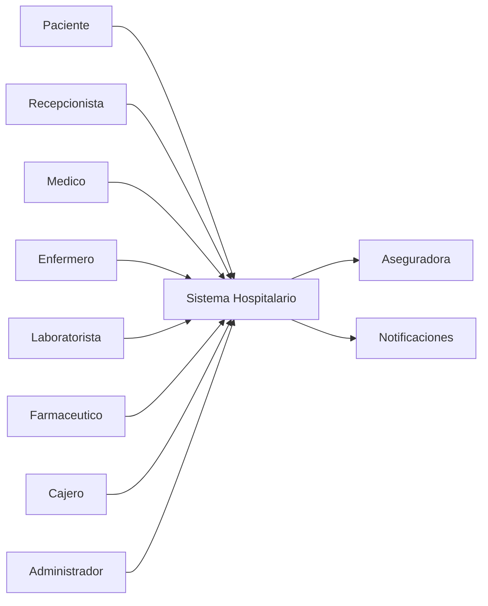
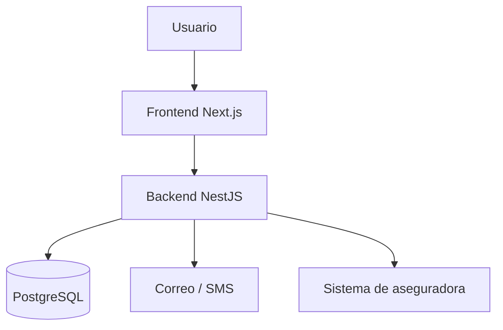
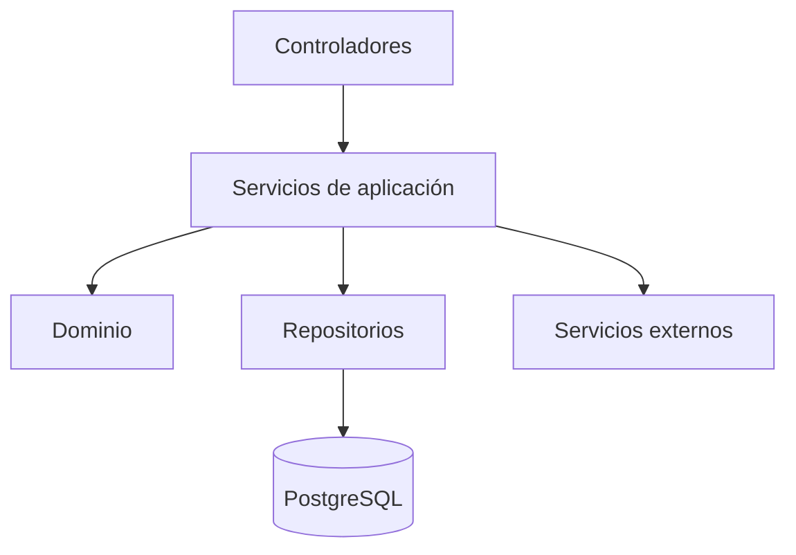
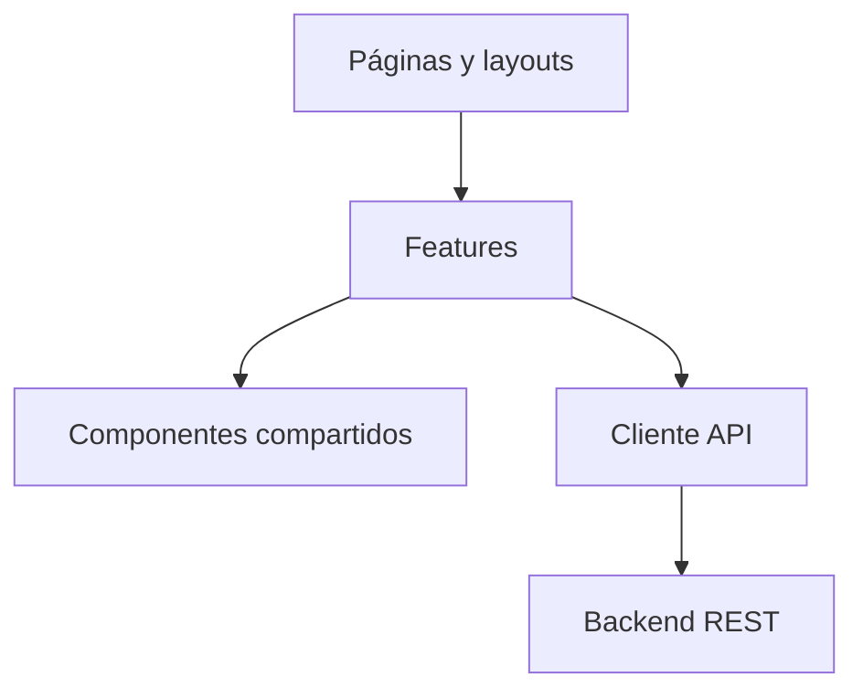

# Diagramas de arquitectura

## Diagrama de contexto

```mermaid
flowchart LR
    Paciente --> Sistema[Sistema Hospitalario]
    Recepcionista --> Sistema
    Medico --> Sistema
    Enfermero --> Sistema
    Laboratorista --> Sistema
    Farmaceutico --> Sistema
    Cajero --> Sistema
    Administrador --> Sistema
    Sistema --> Aseguradora
    Sistema --> Notificaciones
```

## Diagrama de contenedores

```mermaid
flowchart TB
    Usuario[Usuario] --> Web[Frontend Next.js]
    Web --> API[Backend NestJS]
    API --> DB[(PostgreSQL)]
    API --> Mail[Correo / SMS]
    API --> Seguro[Sistema de aseguradora]
```

## Componentes del backend

```mermaid
flowchart TB
    Controllers[Controladores] --> Application[Servicios de aplicación]
    Application --> Domain[Dominio]
    Application --> Repositories[Repositorios]
    Repositories --> Database[(PostgreSQL)]
    Application --> External[Servicios externos]
```

## Componentes del frontend

```mermaid
flowchart TB
    Pages[Páginas y layouts] --> Features[Features]
    Features --> Shared[Componentes compartidos]
    Features --> Api[Cliente API]
    Api --> Backend[Backend REST]
```
